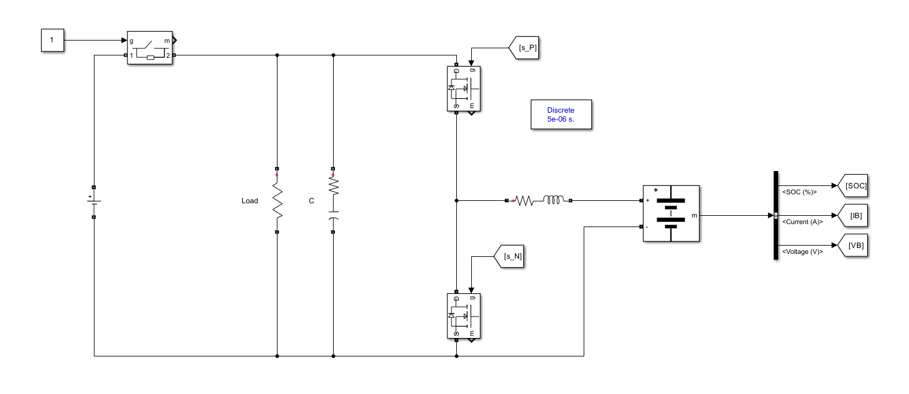
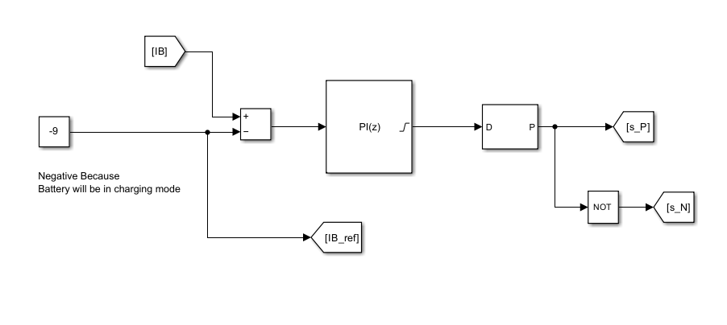
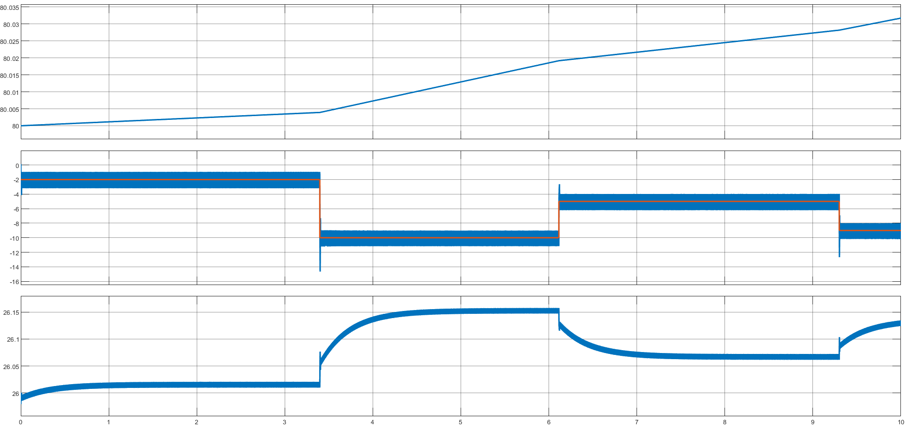
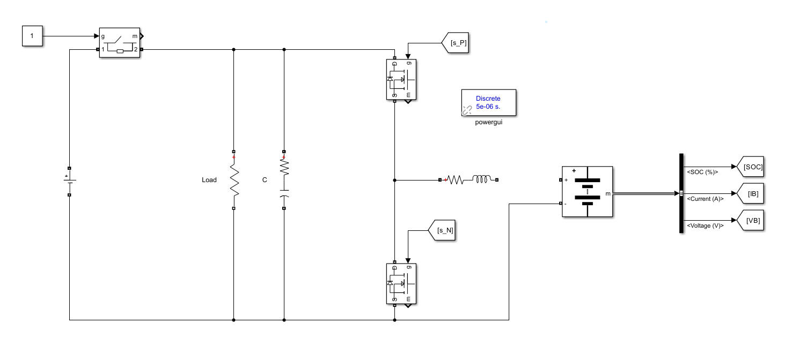
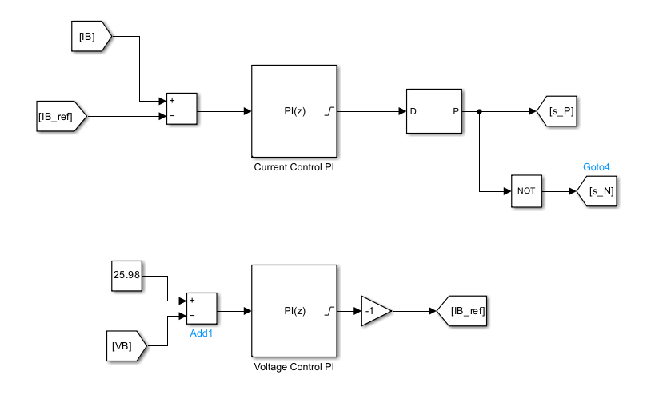
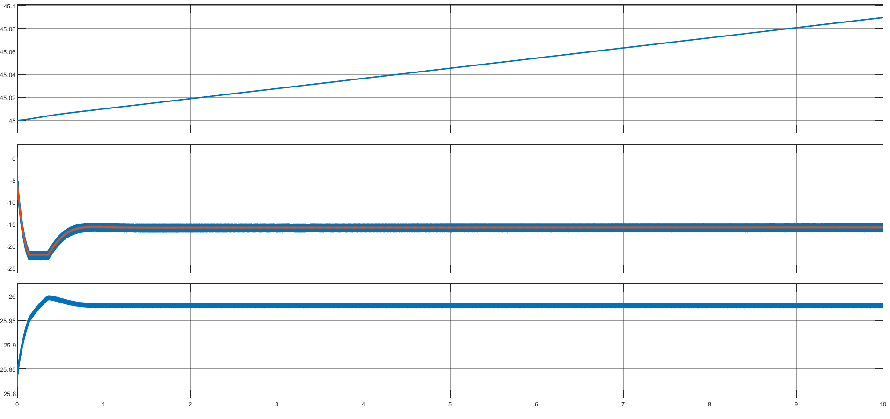
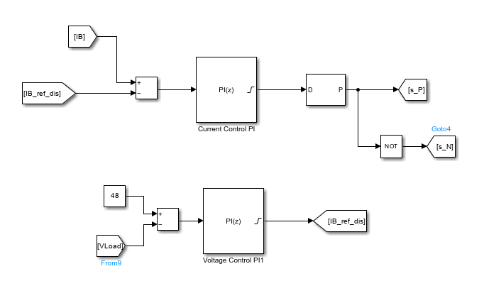
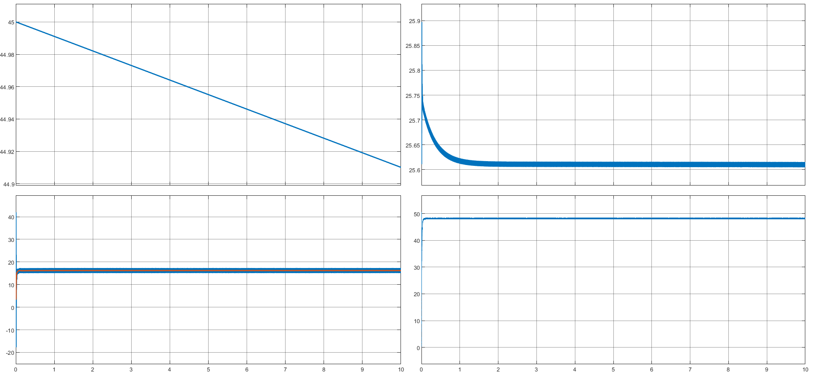
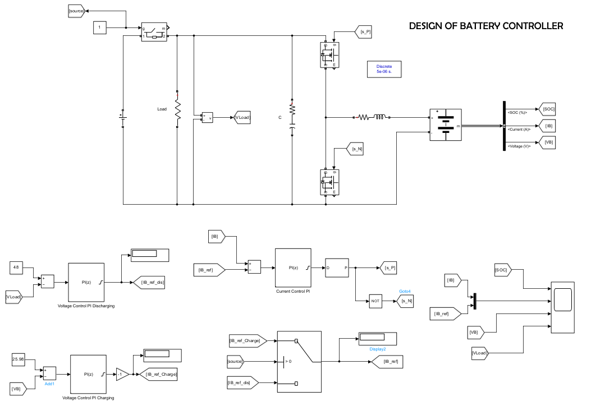
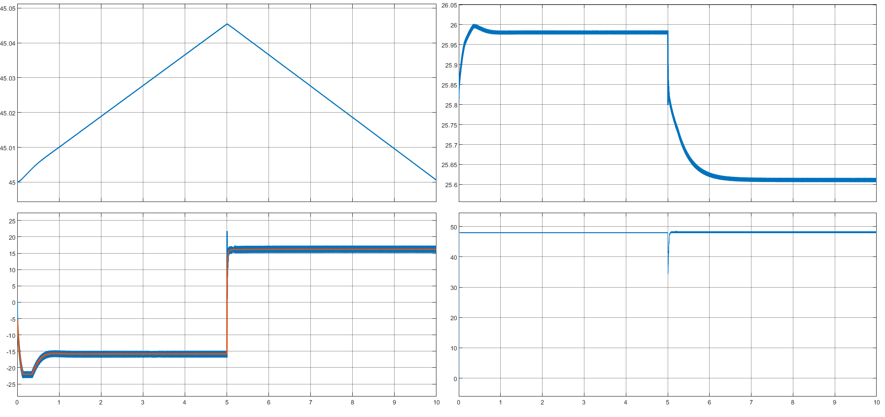

# Battery Power Flow Control for Energy Conversion

## Overview
This repository contains the final report for the course project "Modeling and Designing a Battery Power Flow Control" (EE5610: Digital Controller for Energy Conversion). The project focuses on the design and implementation of a battery power flow control system, which integrates a bidirectional DC/DC converter with PI controllers to manage both charge and discharge modes of a battery. The system ensures efficient power flow to the load under varying operating conditions.

## Project Summary
The battery power flow control system operates in two modes:

1. **Charge Mode**: The battery is charged when the DC voltage source is enabled, and the system uses a PI controller to manage the charging process efficiently.
2. **Discharge Mode**: The battery supplies power to the load when the external voltage source is disabled, ensuring a stable output of 48V.

The report describes the components used in the system, the working of both charge and discharge modes, the control strategies employed, and the implementation of a switching mechanism between the two modes.

## Key Features
- **PI Controllers**: Used for regulating the current and voltage in both charge and discharge modes.
- **Mode Switching**: Automatic transition between charge and discharge modes based on the availability of the voltage source.
- **Battery Charging**: The system ensures safe charging by transitioning from constant current to constant voltage mode at 80% state of charge (SOC).
- **Discharge Management**: The battery delivers a stable 48V output to the load during discharge.

## Report Sections
1. **Abstract**
2. **Battery Power Flow**
3. **Charge Mode**
   - Constant Current Mode
   - Constant Voltage Mode
4. **Discharge Mode**
5. **Mode Switching**
6. **Conclusion**
7. **Future Works**

## Images
The following images are included in the report to illustrate various system components, control processes, and results:

### Battery Flow Model

### Current Control with PI Controller

### Current Control Verification

### Open Circuit Test at 80% SOC

### Voltage Controller for Charging

### Voltage Control for Charging

### Voltage Controller for Discharging

### Voltage Control for Discharging (Graph)

### Final System with Switching Mechanism

### Final Controller Graph (Charging to Discharging Transition)

## Conclusion
This project successfully demonstrates the design and implementation of a battery power flow control model using PI controllers to manage both charge and discharge processes. The system ensures stable power delivery to the load while maintaining efficient battery charging and discharging. Future works will include enhancing the charging algorithm and adding safety features for improved reliability.

## Future Works
- Refining the control algorithm to charge beyond the 80% SOC threshold.
- Adding additional safety features such as overcharge and temperature protection.
- Exploring battery management algorithms to improve performance and lifespan.

